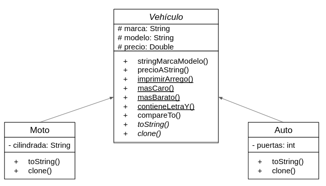

<h1 style="text-align:center">  Ejercicio Trainee Onready</h1>

##### Fernando Paz - [GitHub](https://github.com/fernandopaz1) -[Linkedin](https://www.linkedin.com/in/ferpaz/)

Esta es mi solución al problema de modelar vehículos

Debido a la naturaleza de los objetos a modelar opté por implementar una clase abstracta Vehículo.

De esta clase heredan tanto Auto como Moto. Estas son clases separadas ya que no comparten todas las variables de instancia (puertas o cilindrada).

En la clase vehiculo están programados todos los métodos comunes a Moto y Auto, tales como stringMarcaModelo(), precioAString(), etc. Los métodos mas específicos de cada subclase son agregados en Vehículo como métodos abstractos, lo cual fuerza cada subclase tenga su implementación de estos.

También en Vehiculo hay un conjunto de métodos estáticos (masCaro(), masBarato(), contieneLetraY()) que se encargan de obtener información a partir de una colección de vehículos. Si bien estos cálculos se podrían hacer en cualquier otra parte del código me pareció que estos métodos estáticos eran propios de Vehiculo.

En la clase Main aprovechamos la herencia y el polimorfismo para hacer un ArraList objetos tipo Auto y Moto intercalados.

Debido a que muchos de los cálculos implican una forma de ordenar los datos, la clase Vehiculo implementa la interfaz Comparable<Vehiculo>. Esto permite acceder a métodos de la librería Collections y facilita el ordenamiento utilizando streams.

Usando los métodos de Vehiculo dentro del método main se consigue finalmente imprimir el mensaje:

Marca: Peugeot // Modelo: 206 // Puertas: 4 // Precio: $200.000,00 
Marca: Honda // Modelo: Titan // Cilindrada: 125cc // Precio: $60.000,00 
Marca: Peugeot // Modelo: 208 // Puertas: 5 // Precio: $250.000,00 
Marca: Yamaha // Modelo: YBR // Cilindrada: 160cc // Precio: $80.500,50 
============================= 
Vehículo más caro: Peugeot 208 
Vehículo más barato: Honda Titan 
Vehículo que contiene en el modelo la letra ‘Y’: Yamaha YBR $80.500,50 
============================= 
Vehículos ordenados por precio de mayor a menor: 
Peugeot 208 
Peugeot 206 
Yamaha YBR 
Honda Titan 